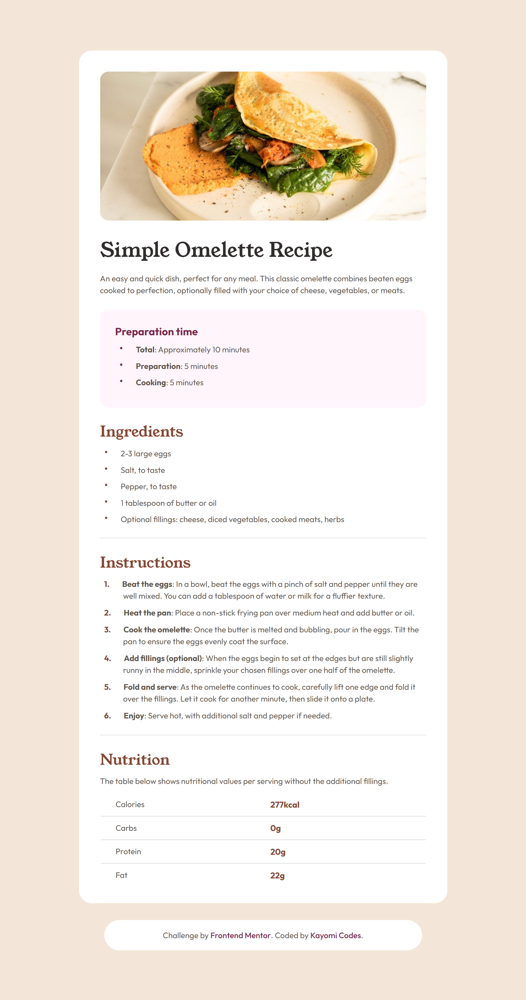
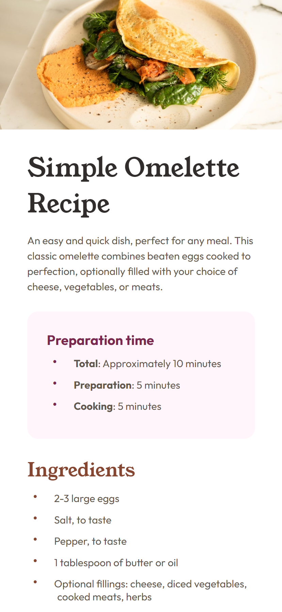

# Frontend Mentor - Recipe page solution

This is a fully responsive solution to the [Recipe page challenge on Frontend Mentor](https://www.frontendmentor.io/challenges/recipe-page-KiTsR8QQKm).

## Table of contents

- [Overview](#overview)
  - [Screenshot](#screenshot)
  - [Links](#links)
- [My process](#my-process)
  - [Built with](#built-with)
  - [What I learned](#what-i-learned)
- [Author](#author)

## Overview

### Screenshot

Desktop result:

Mobile result:

### Links

- Live Site URL: https://kayomi-codes.github.io/recipe-page/

## My process

### Built with

- HTML5
- CSS
- Visual Studio Code

### What I learned

I finally realized the importance of relative units and how they adjust to different kinds of screens and zooms. Along with `display: grid`, this was extremely useful when I had to implement responsive design into the layout.

## Author

- Website - [Kayomi Codes](https://kayomi-codes.github.io/)
- Frontend Mentor - [@kayomi-codes](https://www.frontendmentor.io/profile/kayomi-codes)
- DEV Community - [@kayomi-codes](https://dev.to/kayomi-codes)
